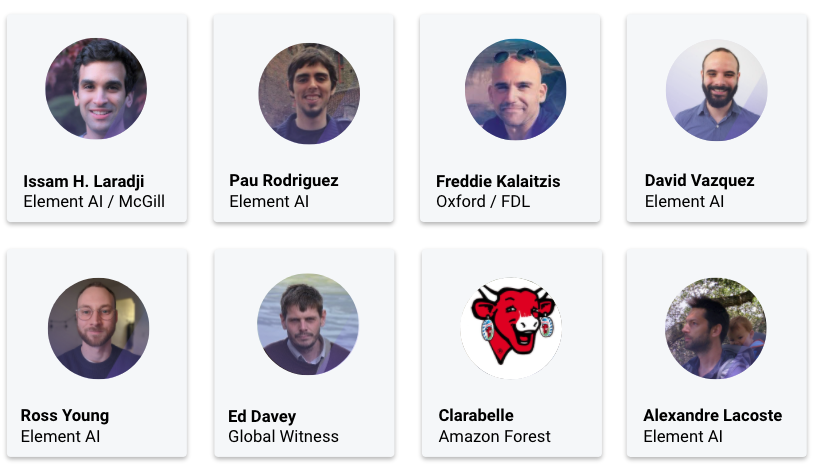

# Counting Cows: Tracking Illegal Cattle Ranching From High-Resolution Satellite Imagery
## Accepted at Neurips2020: Tackling Climate Change with ML Workshop [[paper](https://arxiv.org/abs/2011.07369)] [[slides](results/cownter_strike.pdf)]


## Train LCFCN and CSRNet on the Satellite Images

```
python trainval.py -e cows_counting -sb <savedir_base> -d <datadir> -r 1
```


## Contributers



